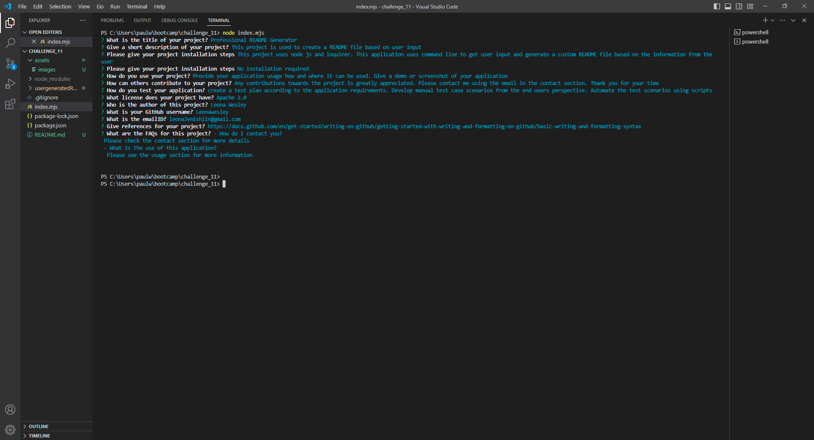
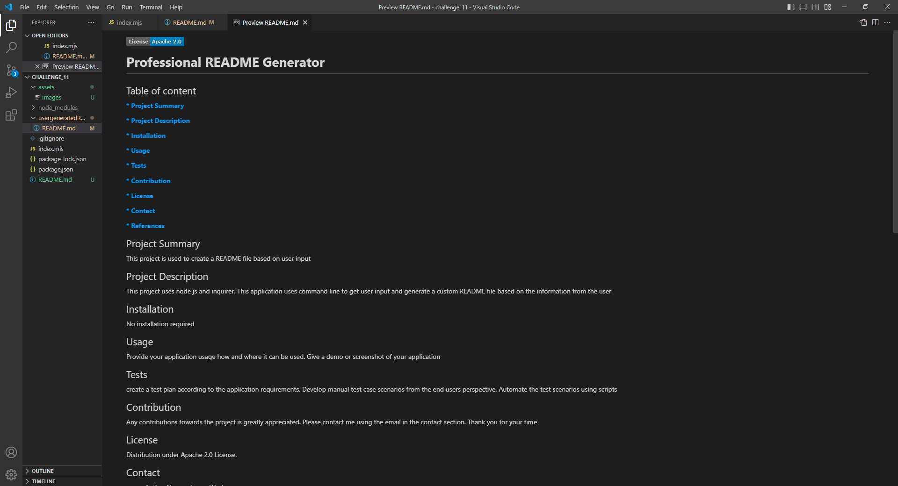

# Unit 11 Challenge: README generator

## Overview

This a command-line application that dynamically creates README.md file based on user's information.

## Project Details

In this application user is allowed to enter input through command-line interface. Based on the information from user a high quality README will be generated. This application uses inquirer package to get user input and fs/promises to write data into a file and await to ensure that events happen synchronously. The input provided by the users are used to fill different sections in the README file and a quality README is generated. This application user to generate their README file very easily.

## Application Demo

[README generator demo.webm](./assets/videos/README_generator_demo.webm)

## Installation

N/A

## License

Please refer to the license in the repo

## Credits

* https://docs.github.com/en/get-started/writing-on-github/getting-started-with-writing-and-formatting-on-github/basic-writing-and-formatting-syntax

* https://www.npmjs.com/package//inquirer?activeTab=readme

* https://www.npmjs.com/package/promise-fs

## Deployed github link

*  https://github.com/Leonawesley/README_generator
